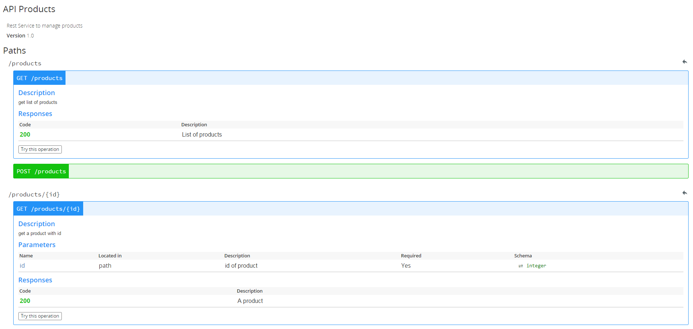

## Swagger NPM

Npm module to generate rest api documentation for NodeJS projects

## Example

<table>
  <thead>
    <tr>
      <th>URI</th>
      <th>Method</th>
      <th>Description</th>
    </tr>
  </thead>
  <tbody>
    <tr>
      <td>/products</td>
      <td>POST</td>
      <td>Create a product</td>
    </tr>
    <tr>
      <td>/products/:id</td>
      <td>GET</td>
      <td>Search product by id</td>
    </tr>
    <tr>
      <td>/products/:id</td>
      <td>PUT</td>
      <td>Update a product</td>
    </tr>
    <tr>
      <td>/products/:id</td>
      <td>DELETE</td>
      <td>Delete a product</td>
    </tr>
  </tbody>
</table>

- GET /products

```javascript
ApiOperation(value='/products', method=HttpMethod.GET, description='get list of products',
  consumes=MediaType.APPLICATION_JSON, produces=MediaType.APPLICATION_JSON,
  parameters=null,
  responses=ApiResponses(ApiResponse(code=HttpStatus.OK, description='List of products')));
app.get('/products', function(req,res){
  res.status(200).send(products);
});
```

- GET /products/:id

```javascript
ApiOperation(value='/products/{id}', method=HttpMethod.GET, description='get a product with id',
  consumes=MediaType.APPLICATION_JSON, produces=MediaType.APPLICATION_JSON,
  parameters=ApiParameters(ApiParameter(name='id', paramtype=ParamType.PATH,
                                        description='id of product', required=true, type='integer')),
  responses=ApiResponses(ApiResponse(code=HttpStatus.OK, description='A product')));
app.get('/products/:id', function(req,res){
  res.status(200).send(products[req.param.id]);
});
```

- POST /products

```javascript
ApiOperation(value='/products', method=HttpMethod.POST, description='create a product',
  consumes=MediaType.APPLICATION_JSON, produces=MediaType.APPLICATION_JSON,
  parameters=ApiParameters(ApiParameter(name='id', paramtype=ParamType.BODY,
                                        description='id of product', required=true, type='integer')),
  responses=ApiResponses(ApiResponse(code=HttpStatus.OK, description='Product has been created')));
app.post('/products', function(req,res){
  products.push(req.body);
  res.status(201).send();
});
```

- PUT /products/:id

```javascript
ApiOperation(value='/products/{id}', method=HttpMethod.PUT, description='update a product',
  consumes=MediaType.APPLICATION_JSON, produces=MediaType.APPLICATION_JSON,
  parameters=ApiParameters(ApiParameter(name='id', paramtype=ParamType.PATH,
                                        description='id of product', required=true, type='integer')),
  responses=ApiResponses(ApiResponse(code=HttpStatus.OK, description='Updated product')));
app.put('/products/:id', function(req,res){
  products[req.param.id] = req.body;
  res.status(200).send(req.body);
});
```

- DELETE /products/:id

```javascript
ApiOperation(value='/products/{id}', method=HttpMethod.DELETE, description='delete a product',
  consumes=MediaType.APPLICATION_JSON, produces=MediaType.APPLICATION_JSON,
  parameters=ApiParameters(ApiParameter(name='id', paramtype=ParamType.PATH,
                                        description='id of product', required=true, type='integer')),
  responses=ApiResponses(ApiResponse(code=HttpStatus.OK, description='Deleted product')));
app.delete('/products/:id', function(req,res){
  var product = products[req.param.id];
  products.splice(req.param.id, 1);
  res.status(200).send(product);
});
```

To generate documentation we call 
```javascript
ApiGenerate(Format.JSON);
or
ApiGenerate(Format.YAML);
```


